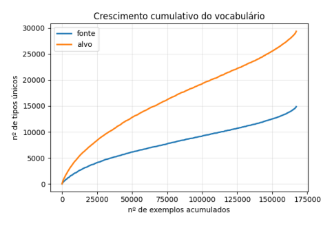
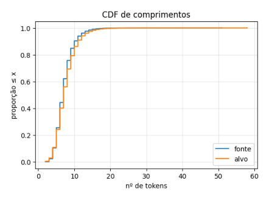
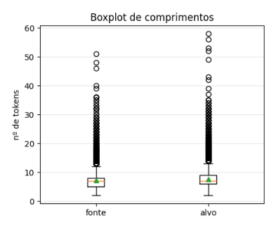
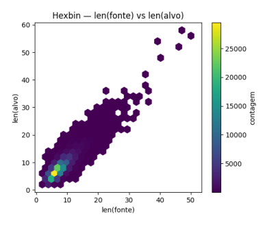
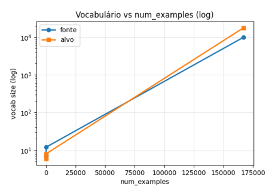
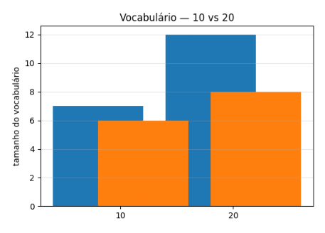
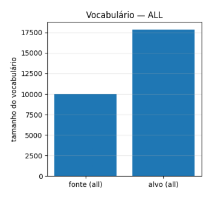
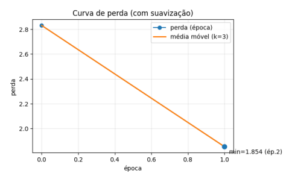
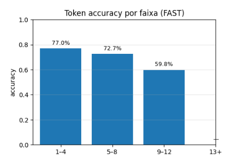

---

# Estudo de Caso — D2L 9.5: Tradução Automática (EN→FR)

Este repositório reproduz e documenta, de forma estruturada, o estudo de caso da seção 9.5 do *Dive into Deep Learning* (D2L) sobre **tradução automática neural**. O objetivo é apresentar um pipeline completo — da obtenção e preparação do corpus paralelo **Tatoeba (EN→FR)** à construção de **minibatches** e **treinamento** de um **baseline Seq2Seq com GRU**, finalizando com análise de métricas e visualizações que caracterizam dados e comportamento do modelo.

---

## Resumo

As etapas implementadas incluem: **download e normalização** do corpus, **tokenização em nível de palavra**, criação de **vocabulários** de fonte e alvo com *tokens* especiais e `min_freq=2`, **truncamento/padding** para `num_steps=12`, montagem de **minibatches** com `valid_len`, e treinamento de um **encoder–decoder (GRU)** com *teacher forcing* e `CrossEntropyLoss(ignore_index=<pad>)`.

A caracterização do conjunto de dados mostra **crescimento sublinear do vocabulário**, compatível com a Lei de Heaps, e **distribuição de comprimentos** concentrada entre 5–12 tokens. Em duas épocas, a **perda** reduz-se de 2.3610 para 1.7593. Na avaliação amostral (**FAST**, 800/10446 *batches*), a **token accuracy** global alcança **67,30%**, com maior acerto em sequências curtas; o **BLEU** médio (1–4, *smoothing*, 20 pares) é \~0,232, valor condizente com um baseline didático sem atenção e com decodificação gulosa.

---

## Estrutura do repositório

```
.
├── notebook/
│   └── Tradução_Automática_Felipe_Sabino_Spina.ipynb
├── images/
│   ├── vocab_growth_cumulative.png
│   ├── lengths_cdf.png
│   ├── lengths_boxplot.png
│   ├── vocab_vs_num_examples_log.png
│   ├── vocab_vs_num_examples_10_20.png
│   ├── vocab_vs_num_examples_all.png
│   ├── loss_curve_smoothed.png
│   ├── token_accuracy_bins_fast.png
│   └── len_hexbin.png
└── README.md
```

As figuras são geradas pelo notebook e salvas com os nomes acima.

---

## 1. Introdução

A tradução automática neural (NMT) trata a tarefa de converter uma sequência em outra, usualmente por meio de arquiteturas **encoder–decoder**. A seção 9.5 do D2L foca no **pipeline de dados** — do texto cru aos *batches* prontos para treino —, aspecto essencial para qualquer sistema NMT. A implementação aqui apresentada enfatiza decisões práticas (normalização, tokenização, vocabulário, *padding/truncation*) e sua influência em eficiência, estabilidade do treino e métricas.

---

## 2. Conjunto de dados

* **Fonte**: Projeto Tatoeba (pares paralelos EN→FR).
* **Formato**: uma linha por par, com separador de tabulação (`EN\tFR`).

### 2.1. Normalização e tokenização

O texto é normalizado com: substituição de NBSP por espaço, conversão para minúsculas e inserção de espaço antes de pontuação (`.,!?`). Em seguida, aplica-se **tokenização em nível de palavra** (didática). O resultado são duas listas de listas de tokens: `source` (inglês) e `target` (francês).

### 2.2. Vocabulários

São construídos **dois vocabulários independentes** (fonte e alvo), cada um com:

* **limiar de frequência** `min_freq=2`;
* *tokens* especiais: `<pad>`, `<bos>`, `<eos>`, `<unk>`.

Termos raros mapeiam para `<unk>`, reduzindo esparsidade e o crescimento explosivo do vocabulário.

---

## 3. Preparação para treino

### 3.1. Truncamento e *padding*

Define-se `num_steps=12`. Sequências menores recebem `<pad>` até 12; maiores são truncadas aos 12 primeiros tokens. Para cada amostra, registra-se **`valid_len`** (comprimento real sem `<pad>`), usado para mascarar *padding* em perda e métricas.

### 3.2. Minibatches

O par (fonte, alvo) é transformado em tensores com formato uniforme, respeitando `num_steps` e `valid_len`. Isso permite **processamento vetorizado** e **treino estável**.

---

## 4. Modelo e treinamento

### 4.1. Arquitetura

* **Encoder**: `Embedding(padding_idx) → GRU`.
* **Decoder**: `Embedding(padding_idx) → GRU → Linear(Vocab_Alvo)`.
* **Objetivo**: *teacher forcing* para prever o **próximo token**; perda de entropia cruzada com `ignore_index=<pad>`.

### 4.2. Configuração de treino

* **Otimizador**: Adam (`lr=3e-3`).
* **Épocas**: 2 (execução demonstrativa).
* **Dispositivo**: CPU (execução registrada); recomenda-se GPU A100/L4/T4 para execuções completas.
* **Telemetria**: barra de progresso, ETA, *throughput* (tokens/s) e média móvel da perda (logs periódicos).

---

## 5. Caracterização do conjunto de dados

### 5.1. Crescimento cumulativo do vocabulário



Observa-se crescimento **sublinear** do número de tipos com o número de exemplos, mais acentuado no francês (alvo), compatível com morfologia/variação lexical maiores.

### 5.2. Distribuição de comprimentos





* Sentenças concentram-se entre **5–12 tokens**, com cauda longa até \~60.
* A correlação entre comprimentos de fonte e alvo é visível no *hexbin*.
* O corte em `num_steps=12` cobre a maior parte dos casos e torna *batches* uniformes; em contrapartida, **há truncamento** em sentenças longas (trade-off clássico entre eficiência e fidelidade).

---

## 6. Efeito de `num_examples` nos vocabulários

Tabela obtida por execução no notebook com `min_freq=2`:

| num\_examples | src\_vocab\_size | tgt\_vocab\_size |
| ------------: | ---------------: | ---------------: |
|            10 |                7 |                6 |
|            20 |               12 |                8 |
|        167130 |            10012 |            17851 |

Visualizações:

* 
* 
* 

À medida que mais exemplos são observados, **novos tipos** aparecem, mas em taxa decrescente (Lei de Heaps). O limiar `min_freq=2` controla o tamanho final mapeando termos raros para `<unk>`.

---

## 7. Resultados do treinamento

### 7.1. Curva de perda



* Época 1: **2.3610**
* Época 2: **1.7593**

A queda acentuada na primeira época seguida de estabilização reflete aprendizado inicial rápido de um modelo de baixa capacidade numa tarefa difícil.

### 7.2. Métricas de avaliação

**Token accuracy** (modo **FAST**, 800/10446 *batches*): **67,30% (global)**.
Por faixas de comprimento (fonte):

* 1–4: **77,32%**
* 5–8: **73,32%**
* 9–12: **60,59%**



A acurácia decresce com o aumento do comprimento: sem mecanismos de atenção e com limite de passos, o modelo tende a degradar em sequências longas.

**BLEU** (média em 20 pares; n-gramas 1–4 com *smoothing*): **≈ 0,232**.
Esse valor é típico para um baseline **Seq2Seq+GRU** com **decodificação gulosa**, **tokenização por palavra** e **treino curto**. Amostras ilustram acertos parciais e erros de repetição/substituição/ordem.

---

## 8. Discussão

### 8.1. Interpretação

* **Dados**: a distribuição de comprimentos motiva `num_steps=12` para viabilizar *batches* estáveis; o custo é o truncamento da cauda.
* **Vocabulários**: o crescimento sublinear observado nas figuras está alinhado à literatura de linguística computacional e explica por que um **limiar de frequência** é útil para conter `<unk>` e acelerar treino.
* **Modelo**: a ausência de **atenção** e o uso de **greedy decoding** limitam coerência e cobertura em frases longas, o que se reflete no perfil da token accuracy por faixa e no BLEU.

### 8.2. Sobre tokenização em idiomas sem separador de palavras

Para idiomas como **chinês** e **japonês**, a tokenização em nível de palavra depende de segmentação prévia e tende a introduzir erros/ambiguidade. Na prática, **subunidades** (e.g., **BPE** ou **SentencePiece**) têm sido preferidas por reduzirem *OOV*, controlarem o vocabulário e lidarem melhor com morfologia produtiva (Sennrich et al., 2016; Kudo & Richardson, 2018). A literatura e o próprio D2L recomendam essas técnicas em pipelines modernos.

### 8.3. Limitações e extensões

* Capacidade do modelo e limite de passos reduzem desempenho em sentenças longas.
* BLEU poderia aumentar com **atenção** (Bahdanau/Luong) ou **Transformer**, **beam search**, **label smoothing**, *learning-rate schedule* com *warmup*, e **subpalavras**.
* *Bucketing* por comprimento diminui *padding* e melhora eficiência.

---

## 9. Reprodutibilidade

1. Abrir `notebook/Tradução_Automática_Felipe_Sabino_Spina.ipynb`.
2. Executar as células na ordem.
3. **Acelerador recomendado**: GPU **A100** (ou L4/T4); CPU funciona, mas é mais lenta.
4. Para execução rápida, usar o modo **subset** e avaliação **FAST**; para relatório completo, usar **ALL** e, opcionalmente, avaliação **FULL**.
5. As figuras são salvas automaticamente em `images/` com os nomes usados neste README.

---

## 10. Conclusão

A implementação evidencia, com dados reais, como **pré-processamento**, **tokenização**, **vocabulário com limiar** e **pad/truncation** estruturam o problema de NMT para permitir **minibatches consistentes** e **treinamento estável**. As métricas e visualizações obtidas contextualizam as decisões do pipeline e o comportamento esperado de um **baseline Seq2Seq (GRU)**, oferecendo uma linha de base clara sobre a qual técnicas modernas (atenção, subpalavras, *beam search*) podem ser adicionadas para ganhos substanciais.

---

## Referências

* Zhang, A.; Lipton, Z. C.; Li, M.; Smola, A. J. *Dive into Deep Learning*. Seção 9.5.
* Sennrich, R.; Haddow, B.; Birch, A. (2016). *Neural Machine Translation of Rare Words with Subword Units*.
* Kudo, T.; Richardson, J. (2018). *SentencePiece: A simple and language independent subword tokenizer and detokenizer for Neural Text Processing*.

---

